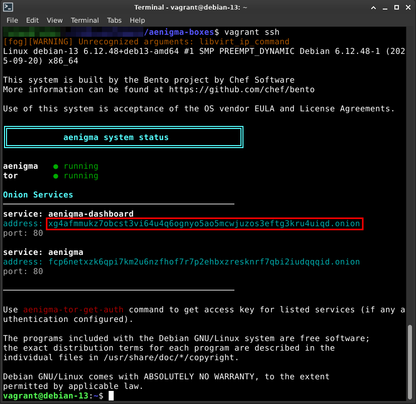
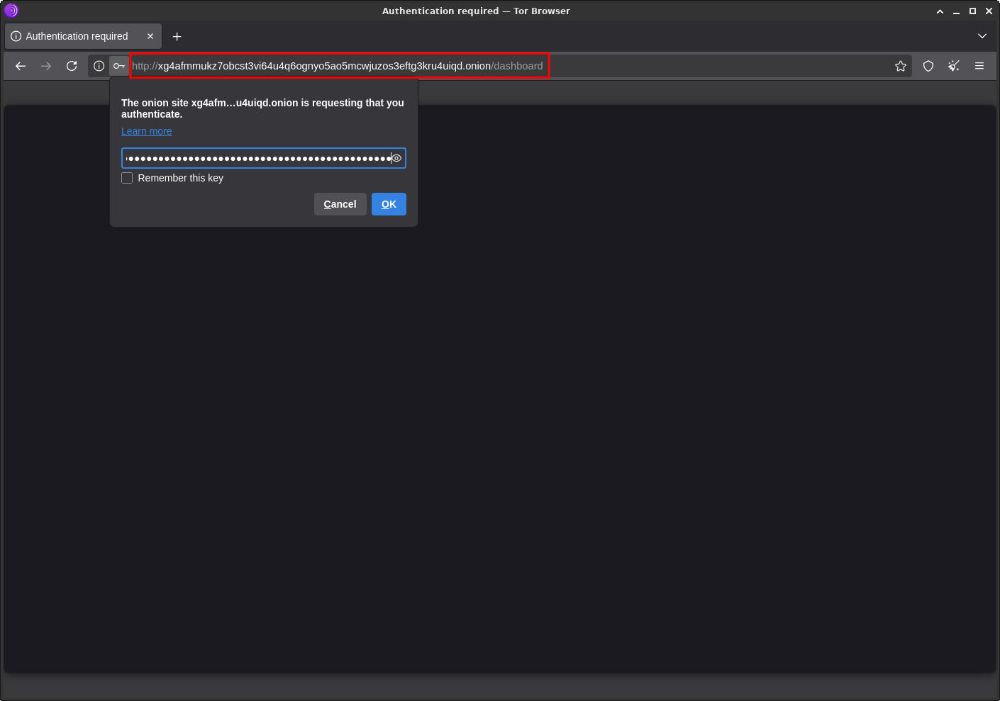
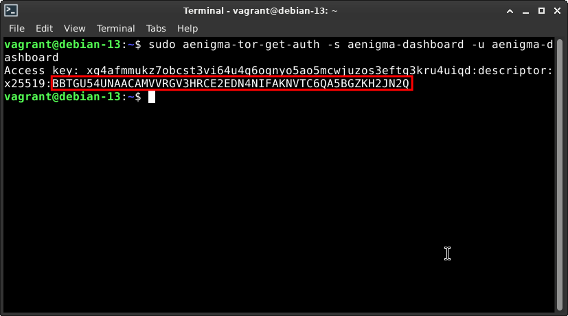
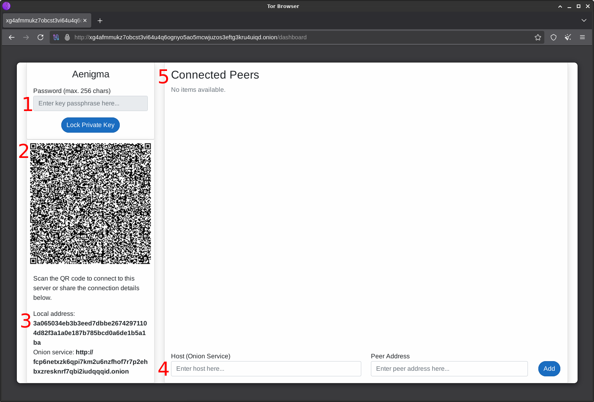
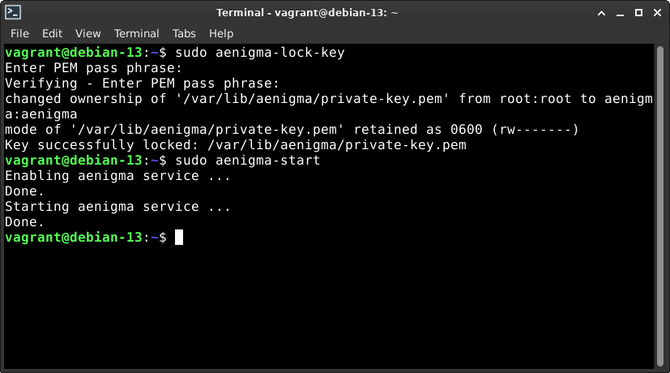

## Găzduiți un server

Aenigma pune la dispoziție o modalitate simplă de găzduire a propriului sistem de
mesagerie privat chiar pe dispozitivul personal al utilizatorului, pentru toate
platformele desktop: Windows, Mac și Linux. Acest lucru este posibil prin virtualizare.
Dispozitivul utilizatorului va deveni gazdă pentru o imagine virtuală a sistemului ce
va rula Aenigma. În prezent sunt puse la dispoziție imagini virtuale pentru
`Virtualbox` și `libvirt/Qemu`. 

### Cuprins

- [Instalarea mașinii virtuale](#instalarea-mașinii-virtuale)
- [Tor Browser](#tor-browser)
- [Aplicația mobilă Aenigma](#aplicația-mobilă-aenigma)
- [Configurarea](#configurarea)
- [Setarea unei parole - Opțional](#setarea-unei-parole---opțional)
- [Federalizarea](#federalizarea)
- [Alte funcționalități](#alte-funcționalități)
- [Contact](#contact)

### Instalarea mașinii virtuale

Accesați [aenigma-boxes](https://github.com/m3sserschmitt/aenigma-boxes)
și parcurgeți pașii necesari instalării imaginii virtuale din documentul
[README.md](https://github.com/m3sserschmitt/aenigma-boxes/blob/gh-pages/README.md). În
continuare vom presupune că utilizatorul a instalat cu succes imaginea virtuală și a
realizat cu succes o conexiune la mașina virtuală Aenigma.

### Tor Browser

Aenigma funcționează prin [TOR](https://en.wikipedia.org/wiki/Tor_(network)), o rețea
susținută de voluntari din intreaga lume ce permite anonimizarea. In plus, ne permite
să găzduim servicii fără înregistrarea unui domeniu de internet propriu și fără expunerea
echipamentelor personale pe internet. Drept consecință, serviciile găzduite prin TOR pot
fi accesate doar prin software specializat. Un astfel de software este
[Tor Browser](https://www.torproject.org/download/) ce trebuie instalat pentru
finalizarea cu succes a configurării.

### Aplicația mobilă Aenigma

[Aplicația mobilă Aenigma](https://play.google.com/store/apps/details?id=ro.aenigma)
integrează [tor-android](https://github.com/guardianproject/tor-android), o biblitecă
nativă Android ce ne permite comunicarea prin rețeaua TOR. Accesați acest
[document](https://github.com/m3sserschmitt/aenigma-articles/blob/gh-pages/user-guide/contacts-screen-ro.md)
pentru a înțelege cum poate Aenigma să relizeze o conexiune prin intermediul rețelei
TOR la serverul privat ce urmează a fi configurat.

### Configurarea

În directorul în care a fost clonat
[aenigma-boxes](https://github.com/m3sserschmitt/aenigma-boxes) (de la pasul
[Instalarea mașinii virtuale](#instalarea-mașinii-virtuale)) se va deschide linia de
comandă și se va realiza o conexiune la mașina virtuală Aenigma prin următoarea comandă:

```bash
vagrant ssh
```

După conectarea cu succes, în linia de comandă va fi vizibil următorul mesaj:



Inițial mașina virtuală va avea configurate două servicii: `aenigma-dashboard` (pentru
administrare) și `aenigma` (folosit de
[aplicația mobilă Aenigma](#aplicația-mobilă-aenigma) pentru conectare
la server). În timp ce serviciul `aenigma` este accesibil tuturor celor care au adresa,
`aenigma-dashboard` este protejat prin cheie de acces. Copiați adresa serviciului
`aenigma-dashboard` și accesați Tor Browser. În bara de adrese introduceți adresa copiată
adăugând `/dashboard`, precum în imaginea următoare:




Pentru a obține cheia de acces
se poate utiliza comanda

```bash
sudo sudo aenigma-tor-get-auth -s aenigma-dashboard -u aenigma-dashboard
```

precum în exemplul următor:



Doar caracterele de după `x25519` vor fi introduse în Tor Browser pentru autentificare.
După obținerea cheii de acces se poate accesa pagina de administrare a server-ului prin
Tor Browser.

> __*Notă*__: Se poate bifa *`Remember this key`* pentru a face conectările viitore mai 
> rapide.

> __*Notă*__: Creați un bookmark pentru această pagină pentru ușura accesările viitoare.



În această pagină observăm următoarele:

1. Câmpul de introducere a parolei server-ului. Inițial nu este configurată și câmpul
este inactiv. Serviciul poate funcționa fără configurarea unei parole însa este
recomadatat ca administratorul să parcurgă acest pas. Vedeți
[setarea unei parole](#setarea-unei-parole---opțional).
2. Codul QR de conectare. Poate fi scanat direct din aplicația mobilă Aenigma pentru
conectare directă. Poate fi distribuit către alte persoane pentru conectare. Vizitați
acest
[document](https://github.com/m3sserschmitt/aenigma-articles/blob/gh-pages/user-guide/servers-bottom-sheet-ro.md)
pentru a afla cum se poate realiza conectarea la server din
[aplicația mobilă Aenigma](#aplicația-mobilă-aenigma).
3. Detaliile de conectare in vederea federalizării. Se pot distribui către alte persoane
ce administrează servere Aenigma în vederea formării unei federații. În acest scenariu
multiple servere comunică între ele iar utilizatorii pot schimba mesaje chiar și când nu
sunt conectați la același server. Vedeți [federalizarea](#federalizarea) pentru mai multe
informații.
4. Zona de introducere a detaliilor de conectare ale altui server, în vederea 
federalizării.
5. Lista serverelor cu care există o conexiune activă.

> __*Important*__: Conectarea între servere __nu__ trebuie făcută din ambele direcții.
> Dacă distribuiți detaliile de conectare (din secțiunea 3 a paginii `/dashboard`) către
> o altă persoană în vederea conectării, atunci __nu__ este nevoie ca dvs. să vă
> conectați în sens invers. Unul distribuie, celălalt inițiază conectarea.

### Setarea unei parole - *Opțional*

Inițial server-ul funcționează fără o parolă - serviciul Aenigma va porni automat odată
cu pornirea mașinii virtuale. Este foarte recomandat ca o parolă sa fie configurată
pentru protejarea cheilor private ale server-ului. Acest lucru se poate face foarte
ușor folosind comanda

```bash
sudo aenigma-lock-key
```

> __*Notă*__: Pe măsură ce sunt tastate caracterele parolei, acestea nu vor fi afișate 
> pe ecran. Este o măsura standard de protecție a confidențialității.

după care se restartează serviciul prin comanda

```bash
sudo aenigma-start
```

precum în exemplul următor:



> După configurarea unei parole, la fiecare pornire va fi necesară verificarea
> paginii `/dashboard` prin Tor Browser. Dacă câmpul parolei este *activ* și permite
> introducerea caracterelor, atunci parola *trebuie* introdusă. Câmpul *inactiv* indică
> faptul că *nu* este necesar ca parola să fie introdusă.

### Federalizarea

Pentru grupuri mici de utilizatori, configurarea unui unic server privat este ușoară și
nu necesită resurse deosebite. Pentru grupuri mai mari sau multiple grupuri ce acționează
independent, un singur server împărțit de toți utilizatorii nu este suficient. În acest
caz fiecare grup își poate configura propriul server de comunicare urmând ca mai apoi să
configureze conexiuni între acestea. *Federația* este așadar totalitatea serverelor între
care există o legatură directă sau chiar indirectă în vederea schimbului de informații.

> __*Exemplu:*__ Trei grupuri independente își configurează câte un server privat de
> comunicare: *A*, *B* și *C*. Putem avea legăturile *A-B*, *A-C* și *B-C* - fiecare nod
> este conectat cu celelalte două. Totuși și varianta cu legăturile *A-B* și *B-C* este
> validă și perfect funcțională deoarece nodurile *A* și *C* vor comunica prin
> intermediul lui B. Similar se poate extinde la 4, apoi la 5 ș.a.m.d.

Prin realizarea acestor conexiuni mesajele sunt sincronizare intre nodurile participante
iar utilizatorii pot comunica chiar și când nu sunt conectați la același nod.

### Alte funcționalități

[Suita Aenigma](https://github.com/m3sserschmitt/aenigma-packages) conține o multitudine
de alte funcționalități printre care:

```bash
aenigma-config
aenigma-tor-auth
aenigma-keys
aenigma-tor-get-auth
aenigma-launcher
aenigma-unlock-key
aenigma-lock-key
aenigma-update
aenigma-proxy
aenigma-vpn-client
aenigma-standard-setup
aenigma-vpn-dns
aenigma-start
aenigma-vpn-server
aenigma-status
aenigma-vpn-server-client
aenigma-tor
aenigma-vpn-server-host
```

Pentru fiecare dintre acestea se poate accesa pagina de ajutor prin

```bash
man aenigma-config
man aenigma-tor-auth
...
```

### Contact

Puteți semnala erori sau propune îmbunătățiri la [contact@aenigma.ro](mailto:contact@aenigma.ro)